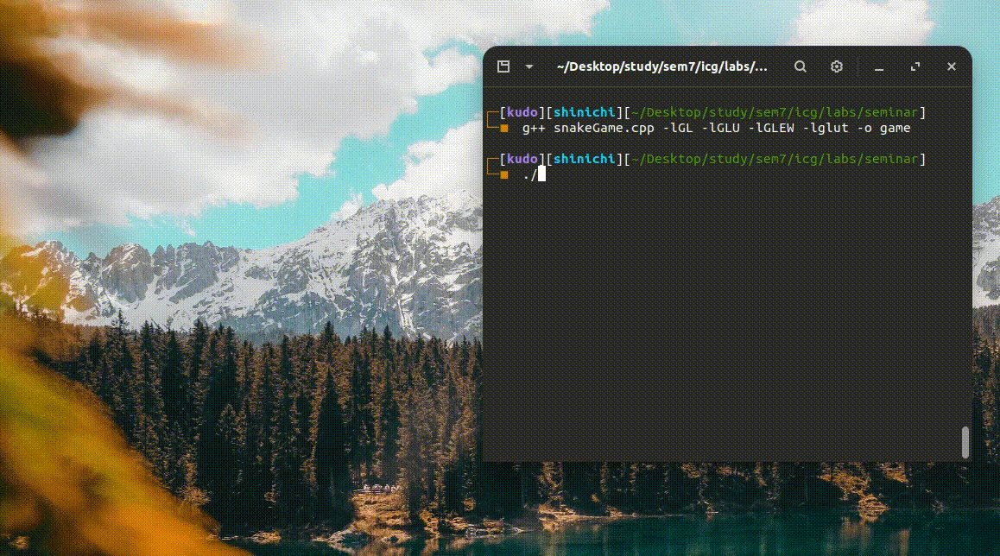

# opengl-snakegame
A simple 2d snake game made using opengl in c++
## Demo



## Keyboard Controls
* P - To resume/start or pause the game
* R - To restart the game
* W - To move up
* A - To go left
* S - To go down
* D - To go right
* M - To change difficulty
* H - For help

## Compilation and Execution
To Compile
```
g++ snakeGame.cpp -lglut -lGL -lGLEW -lGLU -o game
```
To run
```
./game
```
